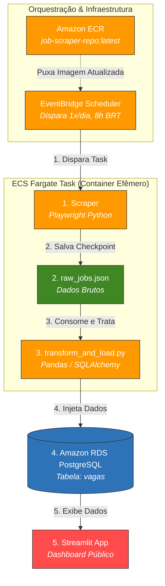

# Job Scraper AWS — Pipeline de Dados de Vagas de Ciência de Dados

Pipeline de dados end-to-end que coleta vagas de emprego (Ciência de Dados / InfoJobs), limpa e estrutura os dados, persiste em um banco relacional na nuvem, executa de forma automatizada e diária, e expõe os resultados em um dashboard interativo.

- **Repositório**: https://github.com/Docas32/job-scraper-aws
- **Dashboard ao vivo**: https://job-scraper-aws-tmj4pb7zhwabldlgwsiubi.streamlit.app/

> **Nota sobre este documento**: esta documentação foi escrita a partir do histórico completo de decisões de arquitetura tomadas durante o desenvolvimento do projeto. A etapa de *scraping* bruto (o script que gera o `raw_jobs.json`) não está detalhada tecnicamente aqui, pois seu código-fonte específico não foi revisado nesta documentação — as demais etapas (transformação, banco de dados, deploy e visualização) refletem exatamente as decisões tomadas e testadas ao longo do projeto.

---

## 1. Objetivo e enquadramento (CRISP-DM)

O projeto segue livremente o framework **CRISP-DM** (Cross-Industry Standard Process for Data Mining), adaptado para um pipeline de engenharia de dados:

| Fase CRISP-DM | O que representa neste projeto |
|---|---|
| Business Understanding | Monitorar automaticamente o mercado de vagas de Ciência de Dados, sem depender de checagem manual em sites de emprego |
| Data Understanding | Vagas brutas extraídas em formato JSON, com campos inconsistentes (texto solto, salário em formatos variados, HTML residual) |
| Data Preparation | Limpeza de texto, parsing de faixa salarial (BRL), deduplicação por link da vaga |
| Modeling / Engineering | Não há modelo preditivo nesta fase — o "modelo" é a própria arquitetura de dados (schema relacional + pipeline de ingestão idempotente) |
| Evaluation | Validação feita via testes manuais de conexão e conferência de contagem de registros inseridos vs. ignorados |
| Deployment | Containerização, execução agendada na nuvem, e exposição via dashboard público |

A camada de *feedback com IA* (mencionada como parte do escopo do projeto) está **mockada** nesta fase — ainda não há chamada real a um LLM; é um ponto reservado para uma fase futura (ver seção 9).

---

## 2. Arquitetura geral

### 🏗️ Arquitetura do Pipeline (AWS Serverless ETL)


- **Por quê essa mudança em relação à versão SQLite**: o pipeline original usava `INSERT OR IGNORE`, sintaxe específica do SQLite que não existe no PostgreSQL. `ON CONFLICT (coluna) DO NOTHING` é o equivalente direto no Postgres, e depende de uma constraint `UNIQUE`/`PRIMARY KEY` na coluna usada como critério de conflito — por isso `link` (que identifica unicamente cada vaga) foi mantido como chave primária também no schema Postgres.
- **Alternativa descartada**: usar `pandas.to_sql(..., if_exists='append')` puro — rejeitada porque o `to_sql` do Pandas não tem suporte nativo a `ON CONFLICT`; ele geraria erro de violação de chave primária a cada linha duplicada, em vez de simplesmente ignorá-la. A solução adotada usa SQLAlchemy diretamente (`connection.execute`) para ter controle total sobre a sintaxe do INSERT.

### 3.5 Containerização — Docker + Amazon ECR

- **Decisão**: pipeline empacotado em uma imagem Docker (`job-scraper-aws`), publicada no ECR (`job-scraper-repo`), região `sa-east-1`.
- **Por quê**: containerizar garante que o ambiente de execução na nuvem seja **idêntico** ao ambiente local testado (mesmas versões de Python, dependências, etc.), eliminando a classe de bugs "funciona na minha máquina". O ECR foi escolhido em vez de Docker Hub por estar na mesma conta/rede da AWS, simplificando permissões (IAM) e evitando limites de rate-limit de registries públicos.

### 3.6 Execução agendada — Amazon ECS (Fargate) + EventBridge Scheduler

- **Decisão inicial considerada e descartada**: **AWS App Runner "Job"**. Essa opção **não existe** no App Runner — o serviço só suporta "Services" (aplicações sempre ativas ou que escalam por requisição HTTP), não execução agendada de containers que rodam até o fim e desligam. Esse ponto foi identificado durante o desenvolvimento e corrigido antes de qualquer tentativa de deploy nessa direção.
- **Decisão final**: **Amazon ECS rodando em Fargate** (serverless, sem gerenciar servidores/EC2) para executar o container, combinado com **Amazon EventBridge Scheduler** para disparar a execução automaticamente.
- **Por quê essa combinação**: é o padrão da AWS para "rodar um container até completar, uma vez, em um horário definido, sem infraestrutura ociosa custando dinheiro entre as execuções" — exatamente o perfil de uma task batch diária, ao contrário de uma API web que precisa ficar sempre no ar.
- **Expressão cron usada**: `0 11 * * ? *` — todos os dias, 11h **UTC**. O EventBridge sempre trabalha em UTC; como o Brasil não tem mais horário de verão desde 2019, o offset de Brasília (UTC-3) é fixo o ano inteiro, então 11h UTC = 8h em Brasília, sem necessidade de ajuste sazonal.
- **Rede da task Fargate**: IP público habilitado (`Auto-assign public IP: ENABLED`), pois a task precisa de saída à internet para baixar a imagem do ECR e conectar ao RDS.

### 3.7 Visualização — Streamlit

- **Decisão**: dashboard em Streamlit, com conexão direta ao RDS via SQLAlchemy + `pandas.read_sql`, cache de dados (`@st.cache_data`, TTL de 10 min) e cache de conexão (`@st.cache_resource`).
- **Por quê cache**: evita que cada interação do usuário (trocar o filtro da sidebar, por exemplo) dispare uma nova query completa no banco — reduz carga no RDS (relevante numa instância pequena, Free Tier) e deixa a interface mais responsiva.
- **Trade-off no componente de tabela**: o pedido original era usar `st.dataframe` (interativo, nativo do Streamlit) **e** renderizar o link da vaga como HTML clicável. Essas duas coisas são mutuamente exclusivas — `st.dataframe` escapa HTML por segurança (evita XSS). A solução adotada foi usar `st.markdown(df.to_html(...), unsafe_allow_html=True)` para a tabela final, priorizando o link clicável em detrimento da interatividade nativa da tabela (ordenar clicando no cabeçalho, redimensionar colunas, etc.).

### 3.8 Variáveis de ambiente e segredos

- **Decisão**: credenciais do banco (`DB_USER`, `DB_PASSWORD`, `DB_HOST`, `DB_PORT`, `DB_NAME`) nunca hardcoded no código — carregadas via `.env` + `python-dotenv` localmente, e via variáveis de ambiente do container na task do ECS.
- **Por quê**: permite versionar o código no GitHub sem expor credenciais, e trocar de ambiente (local → nuvem) sem alterar uma linha de código, só o valor das variáveis.
- **Melhoria futura identificada, ainda não implementada**: mover a senha do banco para o **AWS Secrets Manager**, referenciada na Task Definition do ECS via `valueFrom`, em vez de texto puro nas variáveis de ambiente da task.

---

## 4. Estrutura de arquivos (principal)

> Baseado no que foi desenvolvido nesta conversa — confirme/ajuste conforme a estrutura real do repositório.

```
job-scraper-aws/
├── raw_jobs.json           # saída bruta do scraper (entrada da etapa de transformação)
├── transform_and_load.py   # limpeza, parsing de salário, deduplicação e carga no RDS
├── test_connection.py      # script utilitário para validar conectividade com o RDS
├── create_db.py            # script utilitário usado uma única vez para criar o database jobs_db
├── app.py                  # dashboard Streamlit
├── Dockerfile              # empacotamento do pipeline para execução no ECS Fargate
├── requirements.txt
├── .env                    # credenciais locais (NÃO versionado)
└── README.md
```

---

## 5. Variáveis de ambiente necessárias

| Variável | Descrição |
|---|---|
| `DB_USER` | Usuário master do RDS |
| `DB_PASSWORD` | Senha do usuário master |
| `DB_HOST` | Endpoint da instância RDS |
| `DB_PORT` | Porta do PostgreSQL (padrão `5432`) |
| `DB_NAME` | Nome do banco (`jobs_db`) |

---

## 6. Como rodar localmente

```bash
python -m venv .venv
source .venv/bin/activate          # Linux/Mac
pip install -r requirements.txt    # ou instale manualmente: sqlalchemy psycopg2-binary pandas python-dotenv streamlit

# valide a conexão com o banco antes de rodar o pipeline
python test_connection.py

# rode a transformação e carga dos dados
python transform_and_load.py

# suba o dashboard
streamlit run app.py
```

---

## 7. Deploy (resumo)

1. **Build e push da imagem** para o ECR (`job-scraper-repo:latest`, região `sa-east-1`).
2. **ECS Cluster** (`job-scraper-cluster`, Fargate) + **Task Definition** (`job-scraper-task`) apontando para a imagem do ECR, com as variáveis de ambiente do banco configuradas.
3. **EventBridge Scheduler** disparando a task diariamente às 11h UTC (8h BRT), via `cron(0 11 * * ? *)`.
4. **Dashboard Streamlit** publicado separadamente (Streamlit Community Cloud), lendo os mesmos dados do RDS.

---

## 8. Erros encontrados durante o desenvolvimento (e o que eles ensinaram)

Documentar esses erros aqui é intencional — eles refletem decisões de arquitetura corrigidas em tempo real, não apenas bugs pontuais:

- **`DB name` vazio na instância RDS**: o campo "Initial database name" não foi preenchido na criação, resultando em uma instância sem nenhum banco de dados dentro dela. Corrigido criando o banco manualmente via script Python conectado ao database padrão `postgres` (`CREATE DATABASE jobs_db`).
- **`ResourceNotFoundException` / IP incorreto no Security Group**: o IP residencial usado para testes é dinâmico e mudou entre sessões de desenvolvimento — todo timeout de conexão eventualmente foi rastreado a essa causa. Reforça a importância de documentar esse comportamento para quem for operar o projeto sozinho no futuro.
- **Confusão entre CIDR interno da VPC (`172.31.0.0/16`) e IP público de internet**: uma regra de Security Group usando o range interno da VPC não substitui a necessidade de uma regra separada para acesso externo (e vice-versa) — as duas convivem como regras independentes.
- **`Unable to assume the service linked role` ao criar o cluster ECS**: primeira interação da conta com o ECS — a *service-linked role* não havia sido criada automaticamente. Resolvido criando a role manualmente pelo IAM (ou via `aws iam create-service-linked-role`).
- **App Runner não suporta "Jobs"**: descoberto antes de investir tempo tentando configurar algo que não existe no serviço — pivotado para ECS Fargate + EventBridge Scheduler, que é a combinação correta da AWS para workloads batch agendados.
- **`push access denied` no ECR**: causado por usar um Account ID de exemplo/placeholder em vez do Account ID real da conta ao fazer o tag da imagem — reforça a importância de conferir esse número em cada comando copiado de documentação genérica.

---

## 9. Limitações conhecidas e próximos passos

- **IP dinâmico para acesso local**: dependência de atualização manual da regra de Security Group sempre que o IP residencial muda — não é um problema em produção (a task do ECS usa a regra de VPC interna), mas afeta o fluxo de desenvolvimento/debug local.
- **Sem Secrets Manager**: credenciais do banco trafegam como variáveis de ambiente em texto puro na Task Definition do ECS — funcional, mas não é a prática recomendada para um ambiente além de portfólio/estudo.
- **Sem Multi-AZ / alta disponibilidade**: aceitável para o escopo atual (projeto individual, Free Tier), mas seria um ponto a revisar caso o projeto evolua para um cenário com requisito de disponibilidade real.
